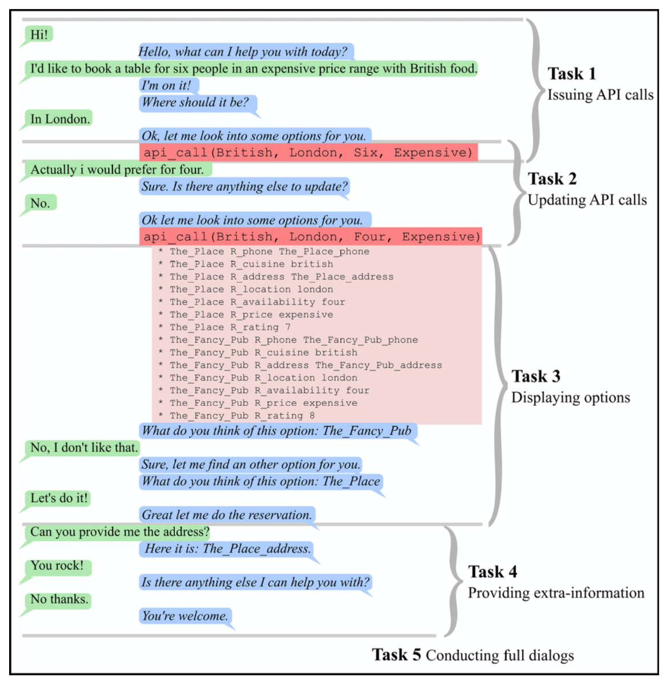
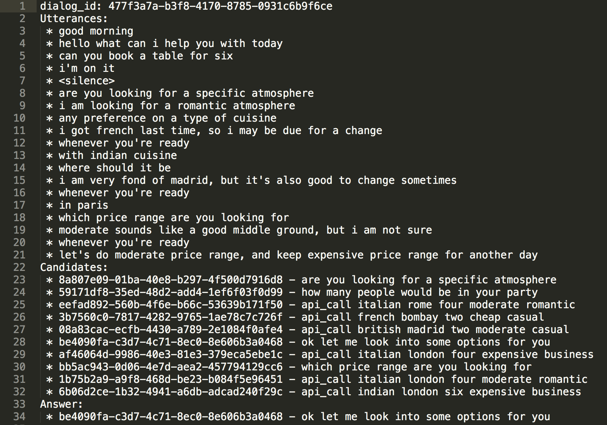

# Dialog State Tracking Challenge 6 (DSTC6)
from Hong Kong University of Science and Technology(HKUST) Human Language Technology Center

## End-to-End Goal Oriented Dialog Learning
This track of the DSTC-6 challenge series is aiming to build End-to-End dialog systems for goal-oriented applications. Goal-oriented dialog technology is an important research issue and End-to-End dialog learning has emerged as a primary research subject in the domain of conversation agent learning. It consists in learning a dialog policy from transactional dialogs of a given domain. In this task, the automatic system responses generated using a given task-oriented dialog data will be evaluated. 

## Problem Format
- Evaluation is conducted in a ranking, not a generation, setting: at each turn of the dialog, the participants have to test whether they can predict bot utterances and API calls by selecting a candidate, not by generating it. 
- Candidates are ranked from a set of candidate utterances and API calls.

## Testing Sets for Competition 
1. uses the same KB as for the train dialogs, and the same set of slots in the queries
2. uses the different KB (with disjoint sets of restaurants, locations, cuisines, etc.), termed Out-Of-Vocabulary (OOV), but the same set of slots in the queries
3. uses the same KB as for the train dialogs, but one additional slot for the queries
4. uses the different KB (OOV) and an additional required slot

## Models
1. `memN2N.py`: 
Implementation of [End-To-End Memory Networks](http://arxiv.org/abs/1503.08895) with sklearn-like interface using Tensorflow.
Modify from the code here: [git@github.com:domluna/memn2n.git](git@github.com:domluna/memn2n.git)

## Requirements
- tensorflow
- python
- numpy
- sklearn

## Scripts 
* `template_memn2n.py`: training script which uses memN2N model + templatized entity  
* `baseline_memn2n.py`: training script which uses memN2N model
* `baseline_random.py`: training script which predicts random
* `baseline_tfidf.py`: training script which uses tfidf method
* `score.py`: calculate precision score
* `data_utils.py`
* `dataset_walker.py`: script for plain data
* `check_validity.py`: script that check for the format

