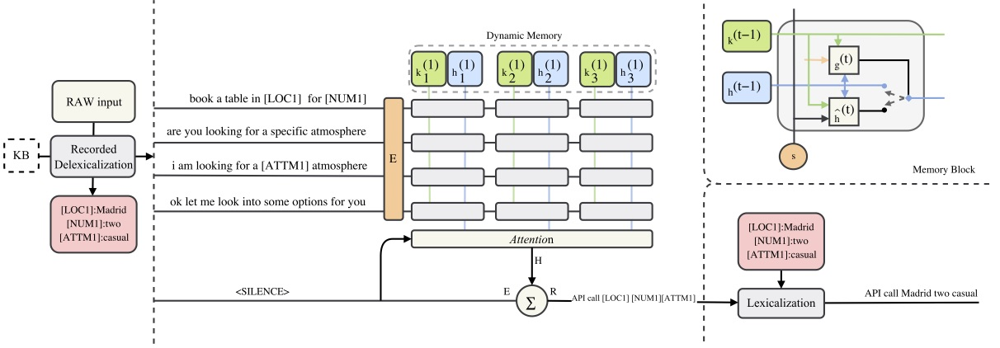
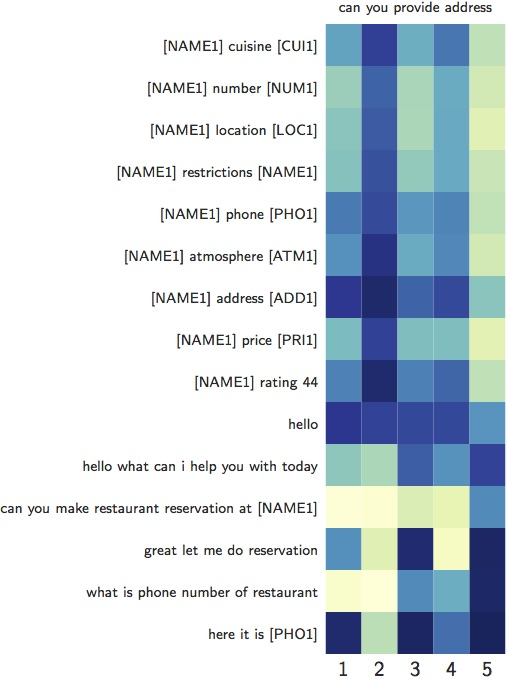

# Dialog State Tracking Challenge 6 (DSTC6) Track1 
## End-to-End Goal Oriented Dialog Learning
from Hong Kong University of Science and Technology(HKUST) Human Language Technology Center

Paper: [End-to-End Recurrent Entity Network for Entity-Value Independent Goal-Oriented Dialog Learning]()



### Setup
* Clone the repo and the dataset
* Run ```python REN.py --train --task=1``` to begin train on task 1
* Run ```python REN.py --train --task=1 --record``` to begin train on task 1 with recorded delexicalization (RDL) data 
* Use ```--augment``` to increase the dataset by partial dialog
* Use ```--generateRDL``` to generate RDL data (which was generated [here](https://github.com/jasonwu0731/RecurrentEntityNetwork/tree/master/data/processed))

### Major Dependencies
- tensorflow 1.2
- python 2.7

### Results


### Testing Sets for Competition 
* Test set 1 uses the same KB as for the train dialogs, and the same set of slots in the queries
* Test set 2 uses the different KB (with disjoint sets of restaurants, locations, cuisines, etc.), termed Out-Of-Vocabulary (OOV), but the same set of slots in the queries
* Test set 3 uses the same KB as for the train dialogs, but one additional slot for the queries
* Test set 4 uses the different KB (OOV) and an additional required slot

